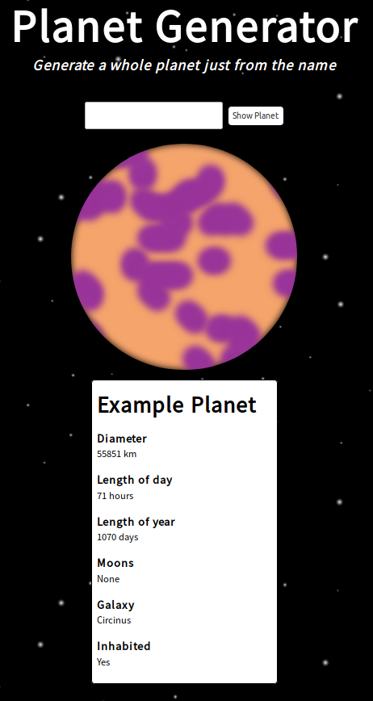

# Planet Generator

A vanilla javascript application, that allows you to procedurally generate a whole planet from only the planet name you supply. The app will generate a picture of the planet and information about the planet. Nothing is randomly generated, so it’s impossible to generate two different planets with the same name.

## How to Run

Extract the zip file the open the **index.html**

## License

This project is licensed under the MIT License - see the [LICENSE](LICENSE) file for details